# Documentation utilisateur

Ce document présente l'essentiel pour utiliser EpiGIMP 2.0 : démarrage, création et ouverture de projets, gestion des fichiers et des calques, outils principaux et conseils pratiques.

---

## Sommaire

- [Lancer le logiciel](#lancer-le-logiciel)
- [Interface principale](#interface-principale)
  - [Barre de menus](#barre-de-menus)
  - [Barre d'outils](#barre-doutils)
  - [Panneau Calques](#panneau-calques)
  - [Canvas](#canvas)
  - [Palette de couleurs](#palette-de-couleurs)
- [Créer un nouveau projet](#créer-un-nouveau-projet)
- [Ouvrir et importer une image](#ouvrir-et-importer-une-image)
- [Ouvrir et enregistrer un projet](#ouvrir-et-enregistrer-un-projet)
- [Exporter l'image finale](#exporter-limage-finale)
- [Gestion des calques](#gestion-des-calques)
  - [Ajouter / Supprimer](#ajouter--supprimer)
  - [Réorganiser](#réorganiser)
  - [Propriétés](#propriétés)
- [Historique](#historique)
- [Outils principaux](#outils-principaux)
  - [Pipette](#pipette)
  - [Pinceau](#pinceau)
  - [Pot de peinture](#pot-de-peinture)
- [Raccourcis principaux](#raccourcis-principaux)
- [Exemples](#exemples)
- [Dépannage rapide](#dépannage-rapide)
- [Ressources](#ressources)

---

## Lancer le logiciel

- Sur Linux (depuis la release AppImage) : rendre le fichier exécutable puis lancer :

```bash
chmod +x epigimp-linux-x86_64.AppImage
./epigimp-linux-x86_64.AppImage
```

- Si vous avez compilé depuis les sources, exécutez `./build/bin/epigimp` depuis la racine du projet.

---

## Interface principale

- Barre de menus : `Fichier`, `Vue`, etc.
- Barre d'outils : accès rapide aux outils (pinceau, pot de peinture, sélection, etc.).
- Panneau Calques : liste des calques, paramètres d'opacité, verrouillage et boutons d'action.
- Canvas : zone centrale pour dessiner et visualiser le rendu.
- Palette de couleurs et gestion de l'historique (annuler/rétablir).

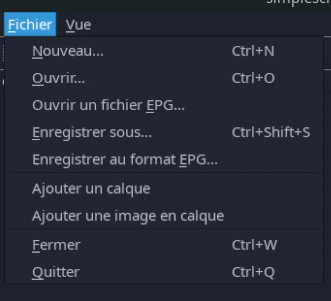
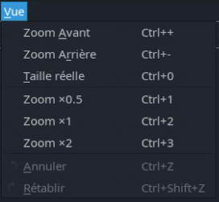


---

## Créer un nouveau projet

- Menu : `Fichier` → `Nouveau projet` (raccourci : Ctrl+N).
- Étapes :
  1. Saisir largeur et hauteur.
  2. L'application crée le canvas et un calque de base prêt à l'emploi.

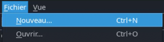
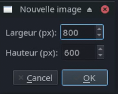

## Ouvrir et importer une image

- Menu : `Fichier` → `Ouvrir` (Ctrl+O).
- Formats supportés : PNG, JPEG et format projet `.epg` (voir section dédiée).
- Comportement : les images PNG/JPEG sont importées comme calque unique ; les fichiers `.epg` ouvrent le projet avec tous les calques et métadonnées.

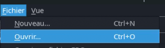

## Ouvrir et enregistrer un projet

- Format `.epg` : archive ZIP contenant `project.json`, `preview.png` et `layers/NNNN.png`.
- Enregistrer : `Fichier` → `Enregistrer` (Ctrl+S) ou `Fichier` → `Enregistrer sous` pour choisir un nouvel emplacement.

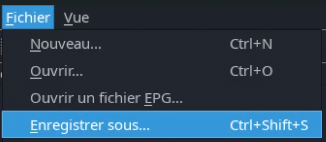

---

## Gestion des calques

- Ajouter un calque : bouton `Ajouter un calque` dans la barre d'outils ou le menu `Calque`.
- Supprimer : sélectionner le calque puis cliquer sur suprimer. Une confirmation s'affiche si le calque contient des données.
- Réorganiser : glisser-déposer les calques dans la liste pour changer l'ordre d'empilement.
- Propriétés : modifier le nom, l'opacité, le verrouillage et la visibilité depuis le panneau Calques.
- Fusionner vers le bas : combine le calque sélectionné avec le calque immédiatement inférieur.

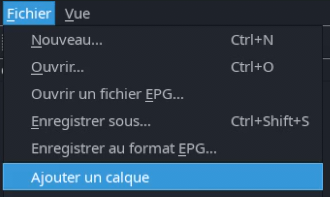
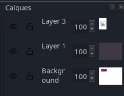
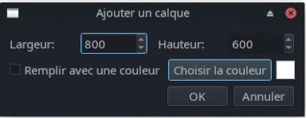

## Historique

- Annuler / Rétablir : `Ctrl+Z` / `Ctrl+Y`. L'historique contient par défaut 20 actions (paramétrable dans les préférences).

## Outils principaux

### Pipette

- Permet de prélever une couleur directement sur le canvas.
- Sélectionnez l'outil Pipette puis cliquez sur l'image pour définir la couleur active dans la palette.
- Raccourci : `O`.

### Pinceau

- Outil principal de dessin pour tracer des traits avec pression et opacité variables selon les paramètres du pinceau.
- Raccourci : `P`.

### Pot de peinture

- Remplit une zone contiguë avec la couleur active en fonction de la tolérance et du mode de fusion sélectionnés.
- Utilisation : sélectionner le pot de peinture puis cliquer sur la zone à remplir. Ajustez la tolérance pour contrôler l'étendue du remplissage.
- Raccourci : `Maj+B`.

---

## Raccourcis principaux

| Action             | Raccourci       |
| ------------------ | --------------- |
| Nouveau projet     | Ctrl+N          |
| Ouvrir             | Ctrl+O          |
| Enregistrer        | Ctrl+S          |
| Exporter           | Ctrl+Maj+E      |
| Annuler / Rétablir | Ctrl+Z / Ctrl+Y |
| Pinceau            | P               |
| Gomme              | Maj+E           |
| Pot de peinture    | Maj+B           |
| Pipette            | O               |
| Texte              | T               |
| Zoom +/-           | Ctrl + / Ctrl - |
| Fermer             | Ctrl+W          |

---

## Exemples

Voici deux captures illustrant des projets créés avec EpiGIMP :
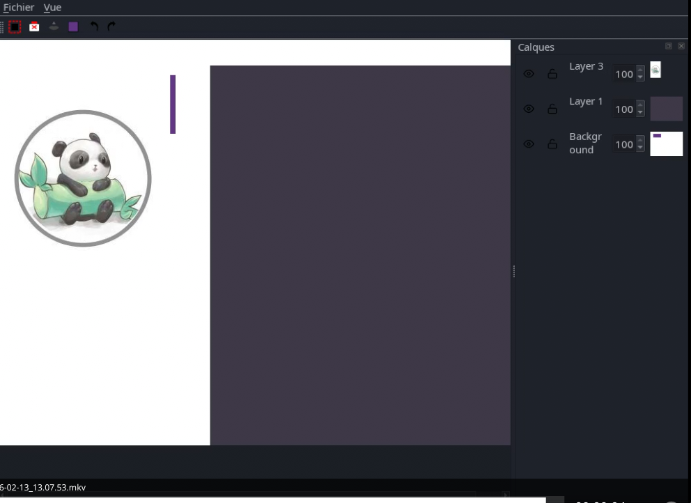
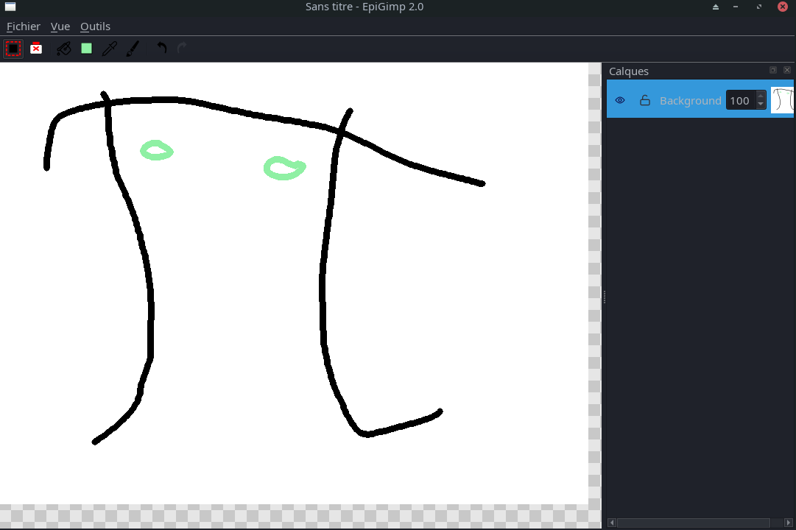

## Dépannage rapide

- Format non supporté : vérifier l'extension et l'intégrité du fichier source.
- Espace disque insuffisant : libérer de l'espace ou choisir un emplacement différent.
- Calque verrouillé : déverrouillez le calque dans le panneau Calques avant modification.

---

## Ressources

- README du projet : [README.md](../README.md)
- Spécification du format `.epg` : [epgformat.md](epgformat.md)

## Contact & contribution

Si vous trouvez des erreurs ou souhaitez contribuer à la documentation, ouvrez une issue ou une pull request sur le dépôt. Pour des questions rapides, consultez le fichier `CONTRIBUTING.md`.
